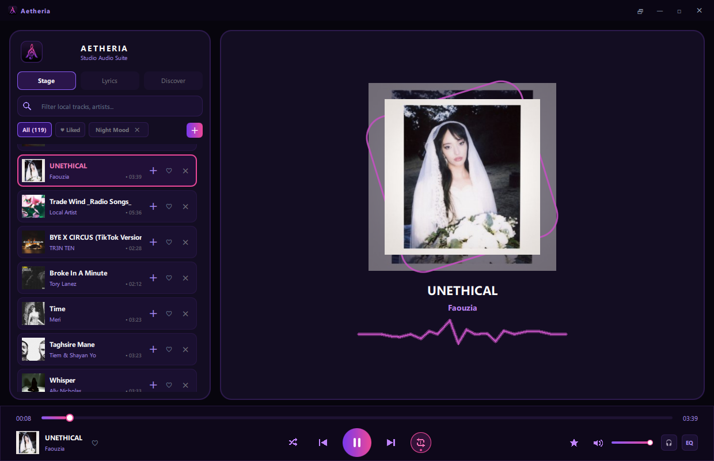
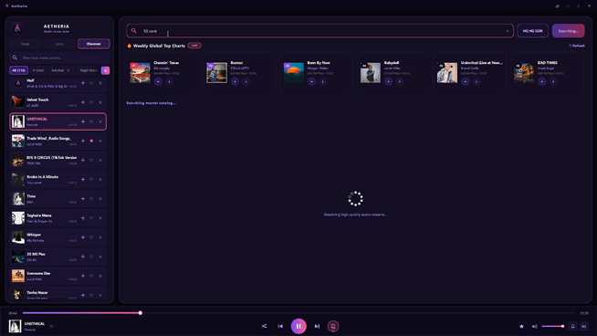
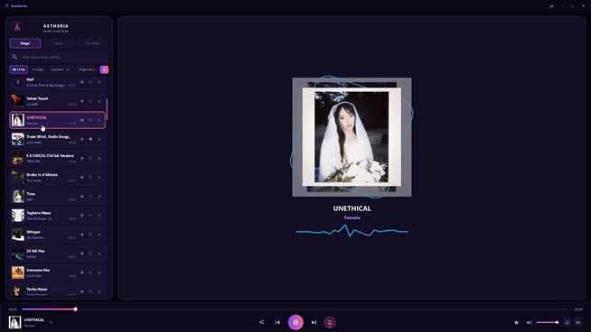
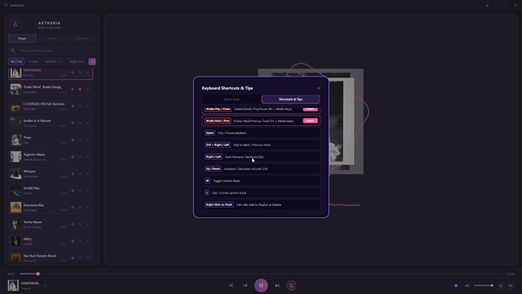

<br>

---
<div align="center">
  
</div>
---

<div align="center">


**A Next-Generation, High-Performance Desktop Music Player & Streaming Suite Built with Modern C++20 and Qt 6 QML.**

</div>


## 🌟 Overview

**Aetheria Music Suite** is a feature-rich, low-latency desktop music player designed for audiophiles and power users. Combining a gorgeous glassmorphic dark interface with a robust, multithreaded C++ backend, Aetheria bridges local file management with seamless, high-fidelity online streaming.

<div align="center">
  
</div>

---

## ✨ Key Features

* **Hybrid Audio Architecture:** Seamlessly manage and play local audio libraries (`.mp3`, `.flac`, `.wav`, `.m4a`, `.aac`, `.ogg`, `.wma`) alongside instant online stream resolution.
* **Resilient Online Engine:** Powered by a dual-fallback resolution pipeline (Direct CDN mirroring & local binary integration) ensuring crash-free, rapid audio acquisition without manual browser or cookie interventions.
* **Studio-Grade Graphic Equalizer:** Custom 10-band hardware equalizer to fine-tune your acoustic experience.
* **Live Global Charts:** Real-time discovery feed featuring trending international charts, instant play capabilities, and direct high-quality track resolution.
* **Intelligent Lyrics Sync:** Real-time synchronized lyrics fetching and display engine that follows playback precisely.
* **Global Shortcuts & Mini-Player:** Dedicated floating mini-player mode and system-wide hotkeys (`Ctrl + Shift + M`) for effortless background control.
* **Advanced Playlist Management:** Full local library search, incremental directory scanning, custom playlists, and batch track operations.
* **Sleek Glassmorphic UI:** Modern purple-themed UI built purely in QML with smooth animations, hardware-accelerated rendering, and frameless window controls.

---

### 🔍 Explore the Experience

<div align="center">
  <p><b>Online Discovery & Global Charts</b></p>
  
</div>

<br>

<div align="center">
  <p><b>Synchronized Lyrics & Glassmorphic Stage</b></p>
  
</div>

<br>

<div align="center">
  <p><b>Floating Mini-Player & Compact Mode</b></p>
  
</div>

<div align="center">
  <p><b>Shortcuts & Professional Tips</b></p>
  
</div>

---

## 🛠️ Technology Stack

* **Core Backend:** C++20, Qt 6 Core / Multimedia / Network / Sql
* **UI/UX Layer:** Qt Quick, QML, Qt Quick Controls & Layouts
* **Database Engine:** SQLite (WAL mode optimized for mechanical & solid-state drives)
* **Stream Resolution:** Integrated local `yt-dlp` pipeline & direct CDN mirroring

---

## 🏛️ Architecture & Project Structure
Aetheria follows a modular structure decoupling UI presentation from the high-performance C++ backend:
* **`TrackModel`:** Core data model handling local library indexing, database queries, and incremental filesystem scanning.
* **`AudioEngine`:** Low-latency playback management using Qt Multimedia and custom audio output device routing.
* **`OnlineSearchEngine` & `LyricsService`:** Multithreaded online streaming resolution and real-time lyrics synchronization.

## 🚀 Quick Start & Build

### Prerequisites
* **Qt 6.7+** (with multimedia and declarative modules)
* **CMake 3.20+**
* **C++20** compatible compiler (MSVC 2022 / MinGW / Clang)

[//]: # (### Compilation)

[//]: # (Clone the repository and build the project using CMake:)

[//]: # ()
[//]: # (```bash)

[//]: # (git clone [https://github.com/Peyman-Ghamari/Aetheria.git]&#40;https://github.com/Peyman-Ghamari/Aetheria.git&#41;)

[//]: # (cd PM-Music-Player)

[//]: # (mkdir cmake-build-release)

[//]: # (cd cmake-build-release)

[//]: # (cmake -DCMAKE_BUILD_TYPE=Release ..)

[//]: # (cmake --build . --config Release)

[//]: # (```)

## ⌨️ Comprehensive Keyboard Shortcuts Reference

| Shortcut | Action Description | Scope |
| :--- | :--- | :--- |
| `Ctrl + Shift + M` | Toggle Floating Mini-Player Mode | **Global** (System-wide) |
| `Media Play / Pause` | Hardware Media Play / Pause (Fn Keys) | **Global** (System-wide) |
| `Media Next / Prev` | Hardware Track Navigation (Fn Keys) | **Global** (System-wide) |
| `Space` | Play / Pause Active Playback | Application |
| `Ctrl + Right` | Skip to Next Track | Application |
| `Ctrl + Left` | Skip to Previous Track | Application |
| `Right / Left` | Seek Forward / Backward (5s) | Application |
| `Up / Down` | Increase / Decrease Audio Volume (5%) | Application |
| `M` | Toggle Instant Mute / Unmute | Application |
| `L` | Like / Unlike Current Track | Application |
| `Right Click` | Open Track Context Menu (Edit Info, Playlist, Delete) | Application |

## ❓ Frequently Asked Questions (FAQ)
* **Q: How does Aetheria handle large local music libraries?**
    * *A:* It utilizes an optimized SQLite database with WAL (Write-Ahead Logging) mode, enabling instant startup and low memory overhead even with thousands of tracks.
* **Q: Can I use global hotkeys while playing games or working?**
    * *A:* Yes! Global shortcuts like `Ctrl + Shift + M` and hardware media keys work system-wide regardless of active application focus.

